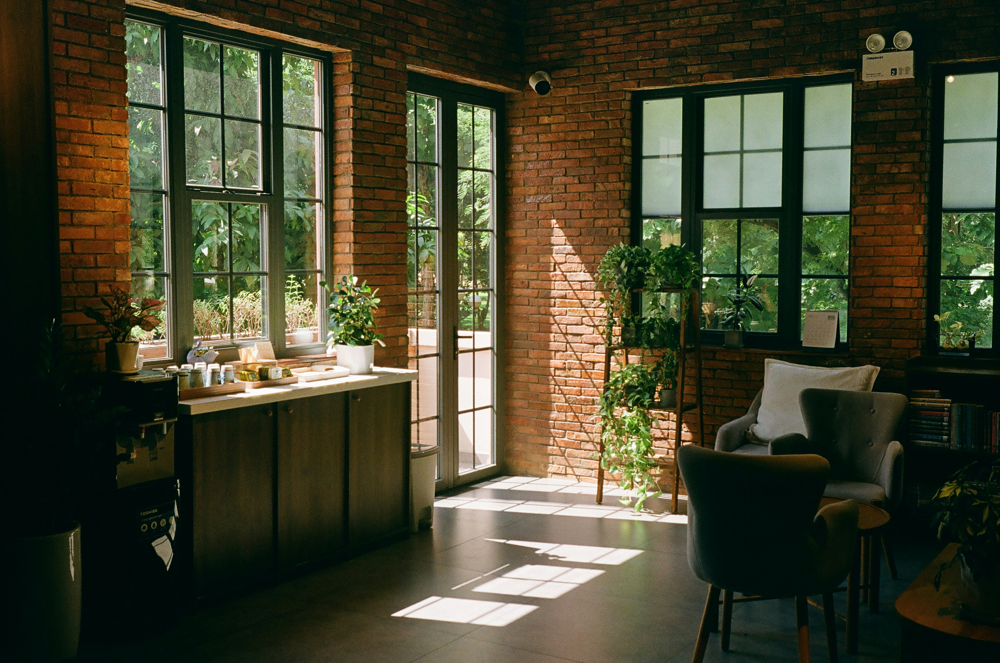

# LHF.co — Art & Faith Café

Welcome to **LHF.co**, a fictional art café where faith, art, and coffee meet in a cozy minimal space.

---

## 📌 About This Project

This is a **responsive static website** built as part of an assignment for Webitect.  
It demonstrates modern web design practices including:
- Hero Banner with call-to-action
- Content section for storytelling
- Card section showcasing features
- Embedded YouTube video
- FAQ accordion with interactive toggle
- Google Fonts for custom brand style
- Responsive navigation with burger menu
- Smooth fade-in scroll animations
- Hover effect CTA with sliding arrow

---

## ⚙️ Tech Stack

- **HTML5**
- **CSS3** (Flexbox, Grid, Media Queries)
- **Vanilla JavaScript** (Accordion, Burger, Intersection Observer)

---

## ✨ Features

- **Hero Banner:** Large hero with brand slogan and CTA button with arrow animation.
- **Content Section:** Brand story about faith and art.
- **Card Section:** Highlights coffee, exhibitions, and workshops with image cards.
- **Embedded Video:** YouTube video for cozy café vibes.
- **FAQ Accordion:** Clickable questions with toggle `+` and `×` symbol.
- **Smooth Animations:** Scroll fade-in for sections.
- **Responsive Nav:** Burger menu for mobile screens.
- **Minimal Dark Theme:** Simple, calm, warm black and gold palette.

---

## 📸 Preview



---

## 🚀 Live Demo

👉 [View This Site on GitHub Pages](https://你的帳號.github.io/你的-repo/)

*(Replace with your actual link after deployment)*

---

## 🔑 How to Use

1. **Clone this repo:**
   ```bash
   git clone https://github.com/yourusername/lhf-co-website.git

## 📑 Attributions
- Hero Banner image from [Unsplash](https://unsplash.com)
- Card Images from [Unsplash](https://unsplash.com)
- Google Fonts: Dancing Script, Roboto
- YouTube Video: Coffee Shop LoFi - Original creator link.
